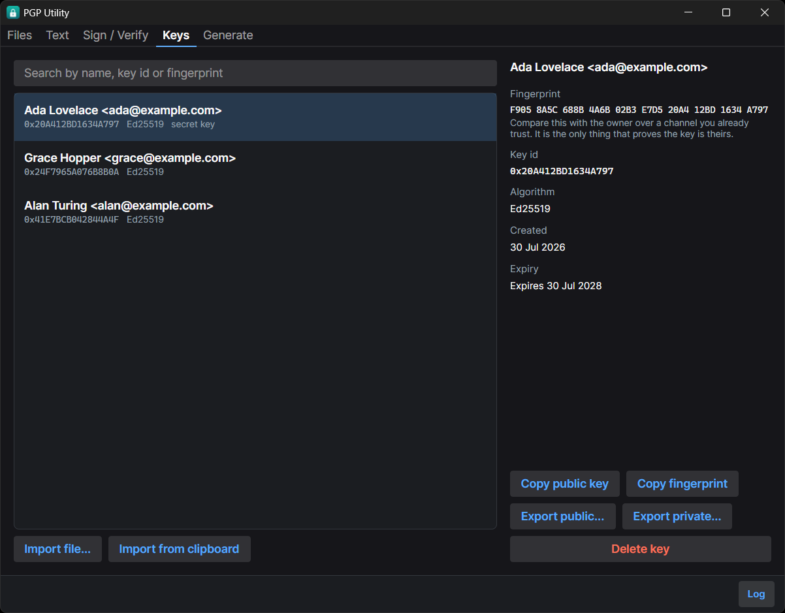
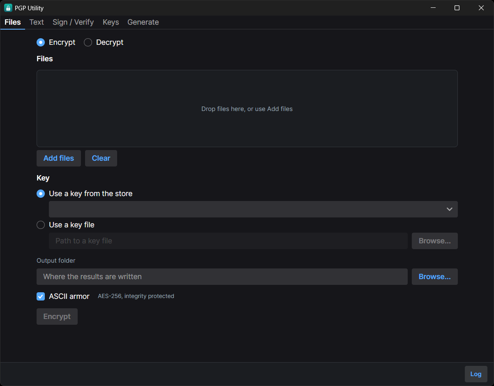
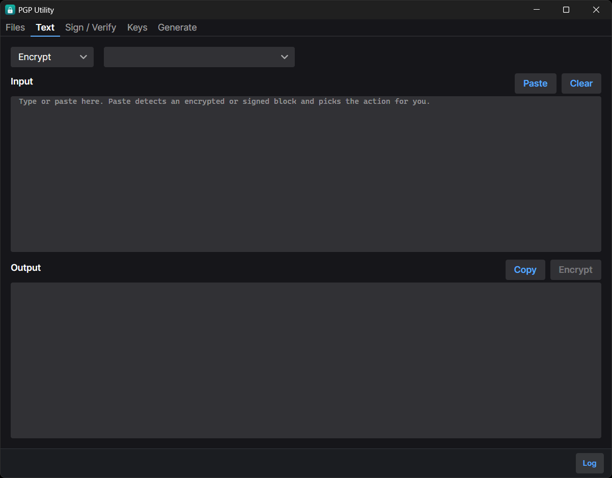
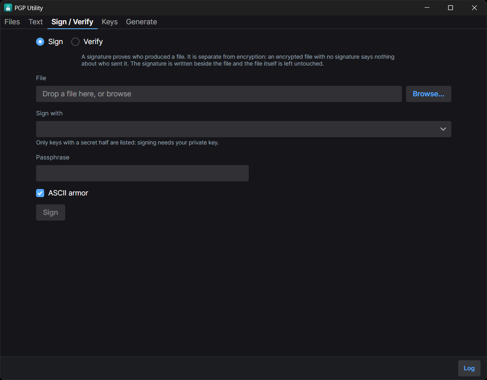

# PGP Utility

A desktop app for OpenPGP: generate keys, encrypt and decrypt files and text, sign and verify.
Windows, macOS and Linux.

Everything happens on your machine. There is no account, no telemetry, and no keyserver: your
keys are never sent anywhere, because there is nowhere for them to be sent.



## Why this exists

There is no shortage of OpenPGP tools. Most of them are one of two things: a command line that
assumes you already know what a subkey is, or a GUI wrapped around a keyserver and a cloud
account.

This one is for the case in between. You have a file or a message, you have someone's public key,
and you want the thing done without learning gpg's flag syntax or signing up for anything. It
tells you what it is doing in the words a person would use, it refuses the options that only make
you less safe, and it says plainly when something cannot be verified rather than showing a green
tick and hoping.

It is a sibling to [resume-builder](https://github.com/Gentian28/resume-builder), and shares its
position: a real desktop application that runs entirely on your machine and sends nothing
anywhere.

## What it does

- **Files.** Encrypt and decrypt, one file or a batch, with progress and cancellation. Drag and
  drop onto the window.
- **Text.** Encrypt, decrypt, sign and verify a block of text, which is what most PGP is actually
  used for. Pasting an encrypted or signed block selects the matching action.
- **Sign and verify.** Detached signatures, so the original file is untouched and someone without
  this tool can still open it. Clear-signed blocks for text.
- **Keys.** Generate Ed25519 or RSA, import, export, search. Fingerprints are grouped so you can
  actually compare them by eye.

| Files | Text | Sign and verify |
|---|---|---|
|  |  |  |

## Cryptography

- **AES-256**, always. Not a setting.
- **Every message carries an integrity check, and decryption verifies it.** A file that fails is
  rejected and produces no output at all. This is what stops someone who cannot read your
  plaintext from flipping chosen bits in it.
- **Ed25519** by default, with a Curve25519 encryption subkey. RSA is available at 2048 or 4096
  bits for older tooling.
- **Revocation certificates** are generated when you create a key. Publishing one retires a key
  you have lost access to, and it cannot be created later, because creating it needs the private
  key and passphrase you would have lost.
- Keys are stored per-platform, and on macOS and Linux the key directory is `0700` and key files
  are `0600`.
- Passphrases are held as character arrays and cleared after use. This narrows the window in which
  a passphrase sits in memory. It is not protection against a machine that is already compromised.

Interoperability with GnuPG is tested in both directions on all three platforms in CI, not
assumed.

**This project has not been independently audited.** See [SECURITY.md](SECURITY.md).

## Install

On Windows, winget is the shortest route:

```
winget install Gentian28.PgpUtility
```

That currently installs **1.0.0**. The community repository accepted the first submission on
2026-08-18, eighteen days after it was opened, and the manifest in review that whole time was
written against 1.0.0, so the index is one version behind this repository until a bump lands.
For 1.1.0 today, take the release below.

Otherwise download from the [latest release](https://github.com/Gentian28/pgp-utility/releases/latest).

| Platform | File |
|---|---|
| Windows | `PgpUtility-win-Setup.exe`, or `PgpUtility-win-Portable.zip` for no installer |
| macOS (Apple silicon) | `PgpUtility-osx-Setup.pkg` |
| macOS (Intel) | `PgpUtility-osx-x64-Setup.pkg` |
| Linux | `PgpUtility.AppImage` |

Nothing needs to be installed alongside it. The .NET runtime is bundled.

### The scary warning you are about to see

**The downloads are not code-signed.** A signing certificate costs a few hundred a year, and this
is a free tool. Unsigned is not the same as unsafe, but it does mean your operating system will
warn you, and hiding that would be worse than explaining it.

**Windows** shows a blue "Windows protected your PC" box. Click **More info**, then **Run anyway**.

**macOS** refuses on first launch, with "cannot be opened because the developer cannot be
verified". Either:

- Right-click (or Control-click) the app, choose **Open**, then **Open** again in the dialog. The
  right-click matters: double-clicking gives you no Open button.
- Or open **System Settings**, go to **Privacy & Security**, scroll to the bottom, and click
  **Open Anyway** next to the message about PGP Utility.

**Linux** does not warn, but the AppImage needs the executable bit:

```bash
chmod +x PgpUtility.AppImage
./PgpUtility.AppImage
```

### Verifying a download

Each release includes `SHA256SUMS-<platform>.txt`. Since nothing is signed, this is the check
worth doing:

```bash
sha256sum -c SHA256SUMS-win.txt        # Linux
shasum -a 256 -c SHA256SUMS-osx.txt    # macOS
```

```powershell
Get-FileHash PgpUtility-win-Setup.exe -Algorithm SHA256   # Windows, compare by eye
```

### Code signing

An application to the [SignPath Foundation](https://signpath.org/) free code-signing programme
was declined in August 2026. The programme requires public adoption signals (stars, forks,
independent references) that a newly published project does not yet have, and it will be
reapplied for once the project has them. Until then the warnings above apply and the checksums
are the verification that counts.

## Where your keys are stored

| Platform | Location |
|---|---|
| Windows | `%APPDATA%\PgpUtility\Keys` |
| macOS | `~/Library/Application Support/PgpUtility/Keys` |
| Linux | `$XDG_DATA_HOME/pgputility/keys`, or `~/.local/share/pgputility/keys` |

Set `PGPUTILITY_KEY_STORE` to put them somewhere else, such as a removable drive.

## Build from source

Requires the [.NET 8 SDK](https://dotnet.microsoft.com/download/dotnet/8.0).

```bash
dotnet build PgpUtility.slnx
dotnet test PgpUtility.slnx
dotnet run --project src/PgpUtility.App
```

The GnuPG interoperability tests skip if `gpg` is not on your PATH. Set `PGPUTILITY_REQUIRE_GPG=1`
to turn a skip into a failure, which is what CI does.

## Project layout

```
src/PgpUtility.Core/    Models and services. No UI dependency, so it is what the tests target.
src/PgpUtility.App/     Avalonia 11 desktop UI, MVVM via CommunityToolkit.
src/PgpUtility.Tests/   xUnit. Round trips, failure modes, permissions, GnuPG interoperability.
packaging/icon/         Icon sources, all generated by make-icon.py.
```

## License

[MIT](LICENSE)
